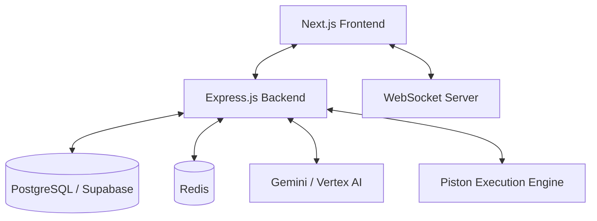

# Sunder Architecture

Sunder is an AI-powered collaborative platform designed for modern developer workflows. This document outlines the high-level architecture, data models, and key system components.

## 🏗️ System Overview

Sunder follows a distributed architecture with a clear separation between the frontend, backend, and data layers. It emphasizes real-time interactivity and AI-driven intelligence.

## 🧩 Core Components

### 1. Frontend (Next.js)
- **App Router**: Handles routing and server-side rendering.
- **Zustand**: Manages global client state (Auth, Editor, AI, Collab).
- **React Query**: Synchronizes server state and handles data fetching.
- **Monaco Editor**: Provides a rich, VS Code-like editing experience.

### 2. Backend (Express.js)
- **REST API**: Standardized endpoints for CRUD and AI operations.
- **WebSocket Gateway**: Handles persistent connections for real-time collaboration.
- **AI Orchestrator**: Manages prompts and interactions with Gemini models.
- **Security Layer**: Multi-layer authentication (Supabase + Local PIN JWT).

### 3. Data Layer
- **PostgreSQL**: Primary data store for users, snippets, organizations, and logs.
- **Redis**: Caching layer for session data and frequent snippet lookups.
- **Supabase Storage**: Object storage for user avatars and snippet assets.

## 📊 Data Models

### Users & Auth
- **Users**: Extended profiles with preferences and "AI signature".
- **Authentication**: Supports standard Email/Password and Security PIN flows.

### Content & Logic
- **Snippets**: The core unit of content, supporting versioning and neural analysis.
- **Organizations**: Groups of users with shared snippets and settings.
- **Code Reviews**: Peer-to-peer and AI-assisted review sessions.

### Intelligence & Real-time
- **AI Usage Logs**: Tracks token consumption and feature popularity.
- **Collaboration Sessions**: Ephemeral session tokens and participant state.

## 🔄 Key Workflows

### AI Snippet Translation
1. User requests translation of a snippet.
2. Backend identifies source code and constructs a persona-based prompt.
3. Gemini processes the translation.
4. Result is validated, logged for usage, and returned to the user.

### Real-time Collaborative Editing
1. User joins or creates a session.
2. A WebSocket connection is established.
3. Edit events and cursor movements are broadcasted to all participants.
4. Changes are periodically auto-saved to the database.

## ⚖️ Security Considerations
- **PIN Auth**: Secondary level of security for sensitive operations.
- **Input Sanitization**: All user-provided code and text are sanitized before storage.
- **Sandbox Execution**: Code is executed in an isolated environment via the Piston API.
