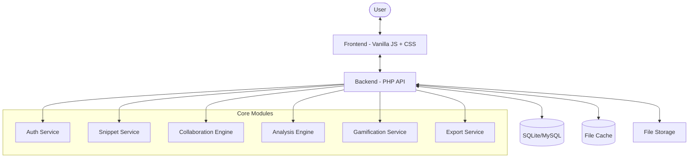
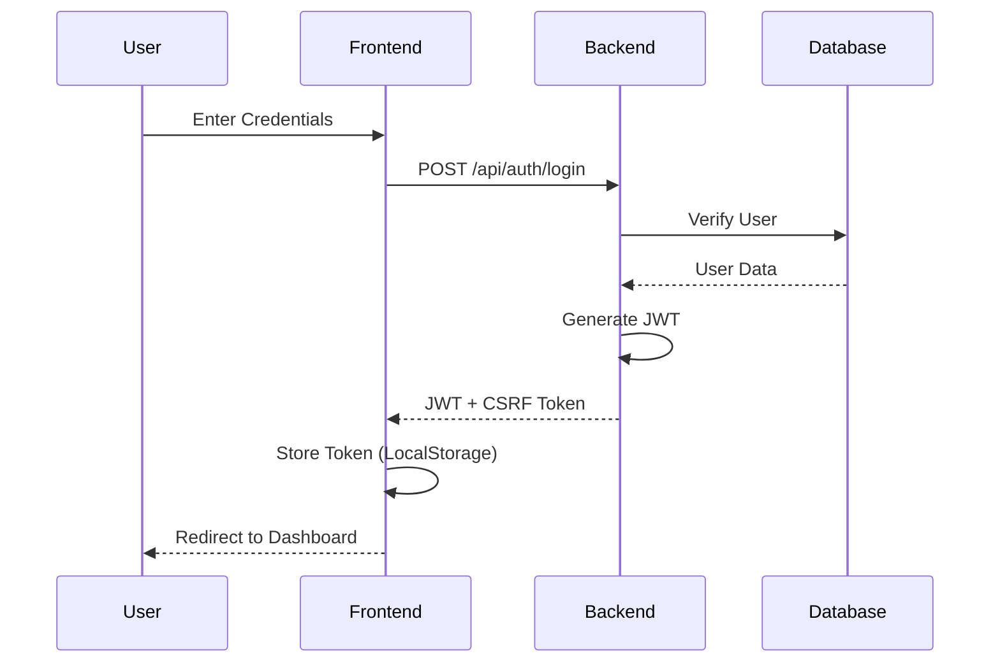
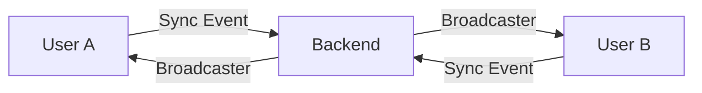

# CodeEngage 2.0 Architecture

## System Overview

```mermaid
graph TD
    User([User]) <--> Frontend[Frontend - Vanilla JS + CSS]
    Frontend <--> Backend[Backend - PHP API]
    Backend <--> DB[(SQLite/MySQL)]
    Backend <--> Cache[(File Cache)]
    Backend <--> Storage[File Storage]
    
    subgraph "Core Modules"
        Auth[Auth Service]
        Snippet[Snippet Service]
        Collab[Collaboration Engine]
        Analysis[Analysis Engine]
        Gamification[Gamification Service]
        Export[Export Service]
    end
    
    Backend --> Auth
    Backend --> Snippet
    Backend --> Collab
    Backend --> Analysis
    Backend --> Gamification
    Backend --> Export
```

## Authentication Flow

```mermaid
sequenceDiagram
    participant U as User
    participant F as Frontend
    participant B as Backend
    participant D as Database

    U->>F: Enter Credentials
    F->>B: POST /api/auth/login
    B->>D: Verify User
    D-->>B: User Data
    B->>B: Generate JWT
    B-->>F: JWT + CSRF Token
    F->>F: Store Token (LocalStorage)
    F-->>U: Redirect to Dashboard
```

## Collaboration Engine (Simplified)

```mermaid
graph LR
    UserA[User A] -- Sync Event --> Backend
    Backend -- Broadcaster --> UserA
    Backend -- Broadcaster --> UserB
    UserB[User B] -- Sync Event --> Backend
```
